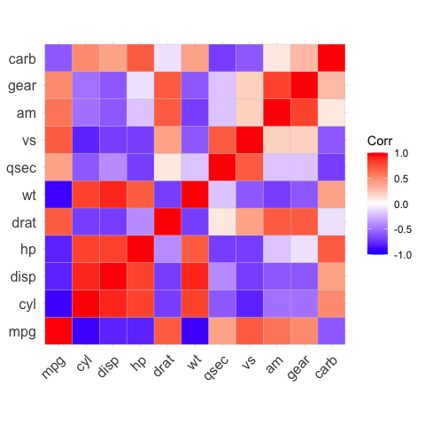

<p align="center">
    </img>
</p>

<div align="center">

[](https://github.com/enfantbenidedieu/ggcorrplot/blob/master/LICENSE)
[](https://pypi.org/project/ggcoorplot/)
[](https://pepy.tech/project/ggcorrplot)
[](https://pepy.tech/project/ggcorrplot)
[](https://pepy.tech/project/ggcorrplot)

</div>

# ggcorrplot: Visualization of a correlation matrix using plotnine

The ggcorrplot package can be used to visualize easily a correlation matrix using plotnine. It provides a solution for reordering the correlation matrix and displays the significance level on the correlogram. It includes also a function for computing a matrix of correlation p-values.

## 1 Installation

### 1.1 Dependencies

ggcorrplot requires :

```bash
Python >=3.10.5
numpy >=1.24.4
pandas >=2.2.2
plotnine >=0.10.1
scipy >=1.10.1
```

### 1.2 User installation

You can install ggcorrplot from `pypi` using pip

```bash
pip install ggcorrplot
```

## 2 Example

```python
# Load mtcars dataset form plotnine
from plotnine.data import mtcars
# Set name as index
mtcars = mtcars.set_index("name")
# Compute a correlation matrix
corr = mtcars.corr().round(1)
from ggcorrplot import ggcorrplot
# Visualize the correlation matrix
# --------------------------------
# method = "square" (default)
p = ggcorrplot(corr)
print(p)
```

<p align="center">
    </img>
</p>

## 3 Author(s)

Duvérier DJIFCK ZEBAZE [djifacklab@gmail.com](mailto:djifacklab@gmail.com)